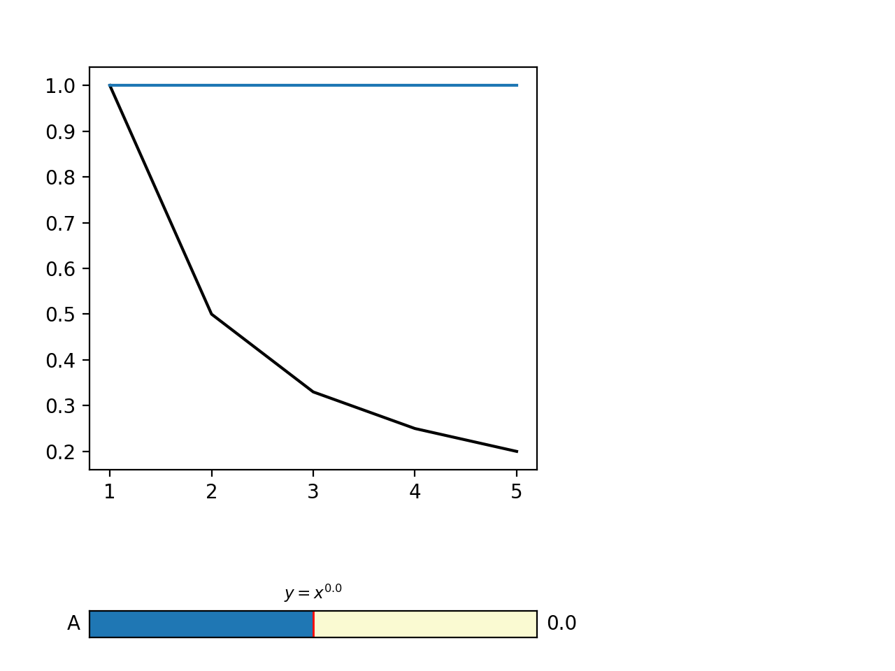

# Slider widget

Reads data from `data.dat` and displays it along with a model curve. One
parameter is implemented that can be selected on a slider and the model line
updates automatically.

To install, run this from the place where this readme file is

    pip install -e .

To get the widget,

- either run `simple_slider` from the terminal
- or from within python do

    ```python
    import simple_slider
    simple_slider.Widget()
    ```


